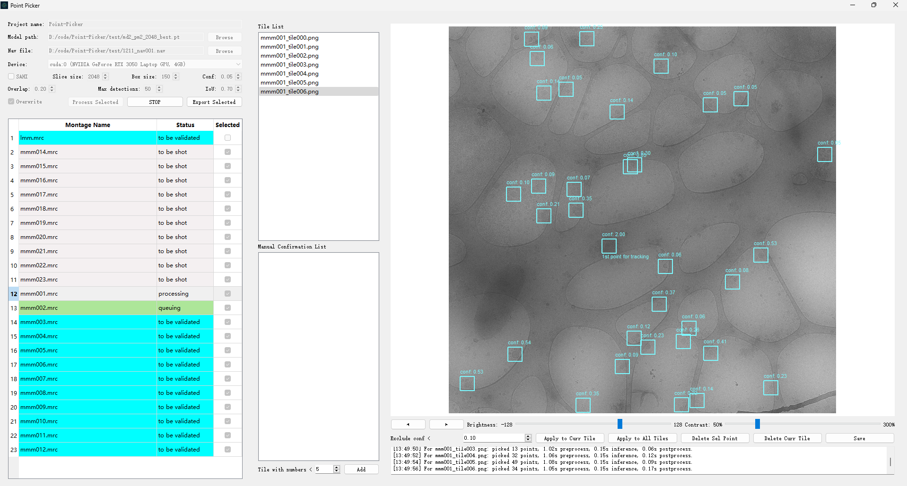
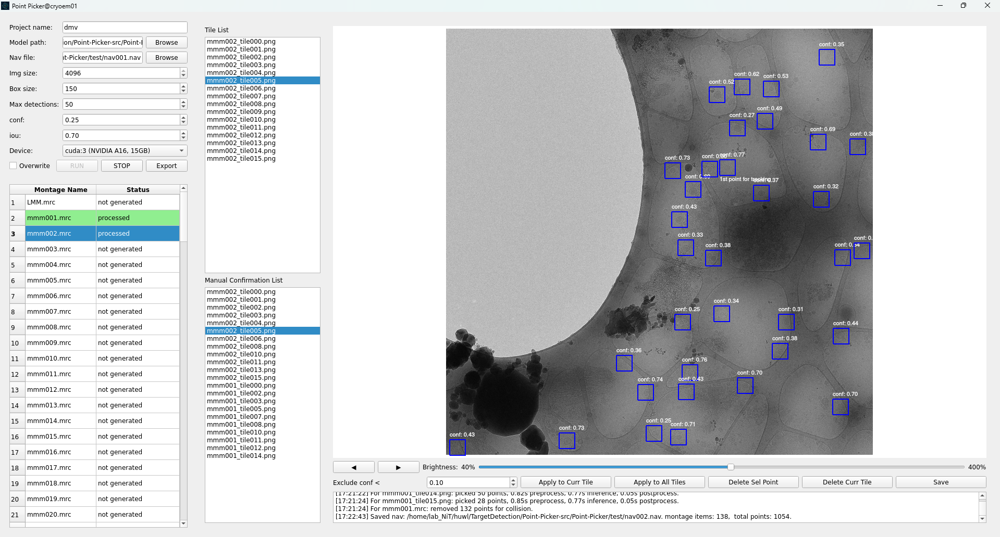

# **Point-Picker: SerialEM Annotation Tool**

Point-Picker is a Graphical User Interface (GUI) tool built with Python and PyQt5, designed for the Cryo-EM field. It monitors the navigator file and montage outputs produced by the SerialEM software, automates YOLO object detection inference, and provides an interactive interface for users to inspect, edit, and export collected coordinate information, ultimately generating navigation files compatible with the SerialEM format.
> 
> *Screenshot of Point-Picker Running on Win11*
> 
> *Screenshot of Point-Picker Running on Linux*

## **⚙️ Project Components**

The project is structured around the following main GUI panels and background mechanisms:

1. **Settings Panel:**  
   * **Function:** Used to set necessary project paths and parameters, such as input nav, model weights, inference threshold, etc.  
   * **Export:** Responsible for exporting the final prediction results into an existing SerialEM navigation file (.nav).  
2. **Status Panel:**  
   * **Function:** Displays all identified Montages and their processing status.  
   * **Control:** Starts and stops the background processing flow, including image splitting and YOLO inference.  
3. **Viewer Panel**  
   * **Function:** The core visualization area. Displays the currently selected Montage or its split Tile.  
   * **Interaction:** Displays YOLO predicted bounding boxes, and allows users to perform interactive label inspection and editing (e.g., manually adding, deleting, or modifying prediction boxes).  
4. **Background Workers:**  
   * **FileSystem Watcher:** Uses the watchdog library to monitor the SerialEM output directory, detecting new navigation files and montages in real-time.  
   * **Processing Pipeline:** Responsible for executing the complex task flow, including:  
     * Splitting the montage image into smaller tiles.  
     * Running the YOLO model on the tiles to perform object detection inference.  
     * Finding coordinate centers and performing deduplication.  
     * Communicating with the main GUI thread.

**Core Dependencies:** PyQt5, cv2 (OpenCV), mrcfile, ultralytics (YOLO), watchdog.
  * Modified line 85 of **.venv/Lib/site-packages/sahi/models/ultralytics.py** from `prediction_result = self.model(image[:, :, ::-1], **kwargs)  # YOLO expects numpy arrays to have BGR` to `prediction_result = self.model(image[:, :], **kwargs)  # YOLO does not expect numpy arrays to have BGR`
  * For now, this tool only record targets with class 0, see line 204 of **gui.py**.
  * To handle the fact that illumina area is around 2X camera field of vision, box size is multiplied by 1.4, see line 208 of **pp_io.py**. 

## **🎯 Execution Logic**

1. **Initialization and Monitoring:**  
   * After the program starts, it loads the project parameters set by the user in the Settings Panel.  
   * The background file system listener starts monitoring the SerialEM output directory.  
2. **Data Ingestion & Pipeline Start:**  
   * When SerialEM generates new .mrc and .mdoc files, the Watcher triggers an event.  
   * The Status Panel updates the montage's information and starts the background processing pipeline for checked items.  
3. **Processing Pipeline (Background):**  
   * **Splitting:** The montage image is loaded and split into tiles.  
   * **Inference:** The ultralytics YOLO model runs on each tile, generating object detection results (bounding boxes and confidence scores).  
   * **Consolidation:** Tile coordinates are remapped back to the original Montage coordinates and deduplicated.  
4. **User Interaction (Foreground):**  
   * The user selects a Montage in the Status Panel; the Viewer Panel loads and displays the Tile.  
   * The user interacts with the Viewer Panel using mouse operations (e.g., clicking, dragging) to manually inspect, correct, or add prediction boxes.  
5. **Data Export:**  
   * The user reorders the montages by dragging each row in the Status Panel and performs the export operation in the Settings Panel.  
   * The program writes reordered and deduplicated coordinate data to the specified .nav file in a SerialEM-compatible format.

## **⌨️ Supported Operations**

| Operation                     | Description                                                                                                                                                                                                                                                                                                                                        |
|:------------------------------|:---------------------------------------------------------------------------------------------------------------------------------------------------------------------------------------------------------------------------------------------------------------------------------------------------------------------------------------------------|
| **Set Project Parameters**    | Preview montage information in .nav file; Load previous predictions if possible.                                                                                                                                                                                                                                                                   |
| **Process/Stop/Export**       | Initiate or stop the background pipeline; Write the reordered and curated coordinate list back into a .nav file.                                                                                                                                                                                                                                   |
| **Reorder Montage/View Tile** | In Status Panel, left-drag to reorder the exported group sequence; In Status Panel or Viewer Panel, Left-click to select a specific montage or its tile for inspection.                                                                                                                                                                            |
| **Edit Predicted Boxes**      | left-click empty => create a point;  left-click existing => select a point;  right-click => move selected to clicked position;  left-drag => pan;  wheel => zoom;  delete / Shift+delete => delete selected/tile;   **S** key/button => save current modification;  apply confidence filter and brightness adjustment. |

## **🚀 Installation and Execution**

### **Environment**

This project requires **Python 3.9.12**.

### **1\. Installation Steps**

1. Clone the Repository:
>git clone https://github.com/huwl404/Point-Picker.git

2. Install Dependencies: Read and modify the requirements.txt depending on your system.
>pip install -r requirements.txt

### **2\. Running the Program**
>python Point-Picker/src/gui.py

## **📦 Packaging Steps**

The project uses **PyInstaller** to bundle the application into a standalone executable on **Window / Linux / MacroOS**.

### **Prerequisites**

Install PyInstaller:
>pip install pyinstaller

### **Using the build.spec File**

The build.spec file ensures all necessary external libraries (like cv2 bindings and ultralytics data) are correctly bundled with the application.

1. Execute the Packaging Command: In the project root directory, use PyInstaller with the provided spec file:  
>pyinstaller build.spec

2. Run the Executable File: The executable will be generated in the dist folder:   
>dist/Point-Picker/Point-Picker[.exe]
